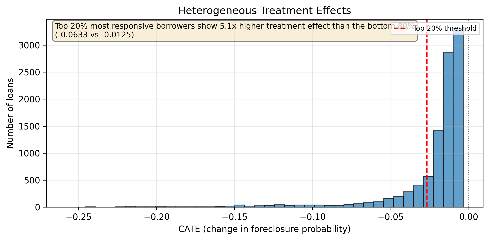
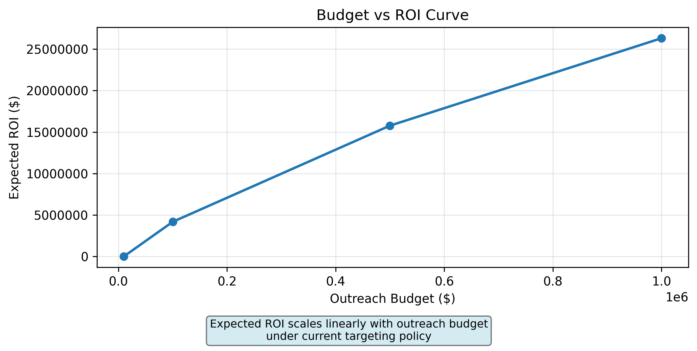

# Counterfactual Loan Modification Targeting

Mortgage servicers lose ~$60,000 on average when a loan ends in foreclosure (the legal process where a lender repossesses and sells a home after the borrower stops making payments). Loan modifications (changes to the loan terms like lower interest rates, extended repayment periods, or temporary payment pauses) cost ~$300 to process and offer. But which distressed borrowers actually benefit from modification, and which would recover on their own?

This project answers that question using causal machine learning. We estimate how much a modification would change each borrower's foreclosure risk. The system then ranks borrowers by expected benefit and allocates outreach budgets to maximize foreclosures prevented per dollar spent.

Built on 1.47 million Freddie Mac mortgage loans from the 2015 vintage.

## Dataset Background

### Freddie Mac Single-Family Loan-Level Dataset

The data comes from the Federal Home Loan Mortgage Corporation (Freddie Mac), a government-sponsored enterprise that purchases mortgages from lenders and packages them into securities for investors. As part of their transparency initiative, Freddie Mac releases anonymized loan-level performance data for research purposes.

**What the dataset contains:**
- Origination details: credit score, loan-to-value ratio, debt-to-income ratio, loan amount, interest rate, property type, occupancy status
- Monthly performance: payment status, delinquency level, principal balance, modification flags, final disposition codes
- Geographic identifiers: state, ZIP code, metropolitan statistical area

**Why this dataset is suitable for causal inference:**
- Large scale: 1.47 million loans provides statistical power to detect heterogeneous effects
- Long observation window: 2015 vintage loans have 6+ years of performance history to observe foreclosure outcomes
- Rich covariates: detailed borrower and loan characteristics help control for confounding
- Clear treatment definition: modification flags indicate when and if a loan received intervention

**Limitations to acknowledge:**
- Observational, not experimental: treatment assignment is not random, requiring careful causal methods
- Selection bias: only loans purchased by Freddie Mac are included, which may differ from the broader mortgage market
- Missing data: some fields like DTI are coded as 999 when not reported, requiring imputation or exclusion

## The Problem

Servicers face a costly decision every day. A borrower is 60+ days behind on payments. Do we offer a loan modification?

| Decision | If borrower would recover anyway | If borrower would foreclose without help |
|----------|--------------------------------|-----------------------------------------|
| **Offer modification** | Waste $300 on unnecessary outreach | Spend $300 to save $60,000, net gain $59,700 |
| **Skip modification** | Save $300, no loss | Lose $60,000 to foreclosure costs |

The challenge is we never observe both outcomes for the same borrower. Historical data is confounded: modifications are only offered to the most distressed borrowers, so simple comparisons make modifications look ineffective or even harmful. Live A/B testing is unethical and impractical at scale.

The core question is counterfactual: for this specific borrower, how much would their foreclosure risk change if we offered a modification versus doing nothing?

## The Approach

We use doubly robust causal inference to estimate heterogeneous treatment effects from observational data.

1. **Restrict to distressed borrowers** to ensure treated and control groups face similar baseline risk
2. **Filter by propensity score overlap** to remove loans where treatment assignment is deterministic
3. **Train nuisance models** with LightGBM to predict both foreclosure risk and modification likelihood from observed features
4. **Estimate CATE** with EconML's CausalForestDML, which residualizes confounding before building a forest of causal trees
5. **Translate to dollars** using servicer economics: `utility = |CATE| * $60,000 - $300`
6. **Rank and target** borrowers by expected net benefit under budget constraints

## Key Results

### Treatment Effect Heterogeneity


Most distressed borrowers see modest benefit from modification, but a minority in the left tail show substantial risk reduction. The top 20% most responsive borrowers experience 5.1x greater foreclosure prevention than the bottom 80%.

```
Top 20% mean CATE:    -0.0633  (6.33 ppt foreclosure reduction)
Bottom 80% mean CATE: -0.0125  (1.25 ppt foreclosure reduction)
Effect ratio:         5.1x
```

This heterogeneity is the foundation of targeted outreach. Blanket modification offers waste budget on low-benefit borrowers. Targeting the top 20% concentrates impact where it matters.

### Budget vs ROI Curve


Expected ROI scales linearly with outreach budget because the policy always targets the highest-CATE loans first. Diminishing returns are minimal within the at-risk portfolio.

```
Budget      Loans    Expected Savings    ROI Multiple
$10,000     33       $481k               48.6x
$100,000    333      $4.27M              42.8x
$500,000    1,666    $21.36M             42.7x
$1,000,000  3,333    $42.72M             42.7x
```

A $10,000 outreach budget can prevent ~8 foreclosures and generate $471,000 in net savings. The system scales to million-dollar budgets without losing efficiency.

### Top 10 Loans by Expected Benefit

| Rank | Loan ID | CATE | Foreclosure Reduction | Net Benefit | Credit Score | LTV | UPB |
|------|---------|------|---------------------|-------------|-------------|-----|-----|
| 1 | F15Q10339458 | -0.2581 | 25.81% | $15,184 | 688 | 235% | $241k |
| 2 | F15Q10311907 | -0.2509 | 25.09% | $14,754 | 732 | 230% | $238k |
| 3 | F15Q10113920 | -0.2504 | 25.04% | $14,725 | 687 | 168% | $367k |
| 4 | F15Q10042070 | -0.2483 | 24.83% | $14,600 | 758 | 179% | $399k |
| 5 | F15Q10105341 | -0.2478 | 24.78% | $14,568 | 692 | 238% | $202k |
| 6 | F15Q10042072 | -0.2475 | 24.75% | $14,549 | 751 | 160% | $276k |
| 7 | F15Q20200317 | -0.2453 | 24.53% | $14,415 | 745 | 235% | $73k |
| 8 | F15Q10343907 | -0.2452 | 24.52% | $14,412 | 796 | 173% | $269k |
| 9 | F15Q10074761 | -0.2449 | 24.49% | $14,392 | 752 | 147% | $276k |
| 10 | F15Q20301057 | -0.2446 | 24.46% | $14,374 | 742 | 206% | $372k |

All top loans have high LTVs (147-238%), moderate credit scores (687-796), and missing DTI values, consistent with severely distressed borrowers who benefit most from modification.

## Model Performance

### Foreclosure Prediction (LightGBM Classifier)

| Metric | Value | Interpretation |
|--------|-------|---------------|
| AUC-ROC | 0.871 | Strong discrimination between foreclosure and non-foreclosure |
| Average Precision | 0.027 | Expected given 3.5% foreclosure rate in at-risk sample |

### Best Hyperparameters

```json
{
  "n_estimators": 651,
  "max_depth": 3,
  "num_leaves": 33,
  "learning_rate": 0.0123,
  "min_child_samples": 87,
  "is_unbalance": true
}
```

Shallow trees with many estimators and low learning rate prevent overfitting on the imbalanced foreclosure outcome.

## Architecture

```text
Freddie Mac SFLLD (2015Q1-Q4) -> etl_pipeline.py (PySpark)
                                          |
                          freddie_mac_causal_ready.parquet
                                          |
                          train_models.py (LightGBM + Optuna + SHAP)
                                          |
                          stage2_artifacts/ (propensity, outcome, EconML datasets)
                                          |
                          train_causal_forest.py (EconML CausalForestDML)
                                          |
                          policy_simulation.py (cost-aware targeting)
                                          |
                          deploy_api.py (FastAPI endpoints)
                                          |
                          |- /score_loan: real-time modification recommendation
                          |- /budget_plan: ROI projections for outreach spend
                          +- /top_loans: ranked list with loan identifiers
```

## Methodology

### Causal Identification

The project estimates the effect of loan modifications on preventing foreclosure among borrowers who have already reached 60+ days delinquent. Three design choices support valid inference:

1. **Sample restriction**: Analysis focuses on distressed borrowers only, ensuring treated and control groups face similar baseline risk
2. **Temporal validity**: Only modifications occurring before peak delinquency are counted as treatment
3. **Propensity score trimming**: Loans with extreme treatment probabilities are excluded to ensure overlap between groups

### Doubly Robust Estimation

The pipeline uses EconML's CausalForestDML:

- Nuisance models (LightGBM) predict both outcome and treatment from observed features
- Residuals from these models are used to estimate heterogeneous treatment effects
- Bootstrap inference provides confidence intervals for each CATE estimate

This approach reduces bias from observed confounders while allowing effect heterogeneity across borrower segments.

### Business Translation

CATE estimates are converted to dollar impact using servicer economics:

```
utility = |CATE| * $60,000 - $300
```

Loans with positive utility are recommended for modification outreach. The system ranks all candidates by expected net benefit, enabling budget-constrained targeting.

## Project Structure

```
counterfactual-loan-judge/
├── data/
│   ├── historical_data_2015Q{1-4}.txt          # raw origination
│   ├── historical_data_time_2015Q{1-4}.txt     # raw performance
│   ├── freddie_mac_causal_ready.parquet        # Stage 1 output
│   ├── stage2_artifacts/                       # Stage 2 outputs
│   └── stage3_artifacts/                       # Stage 3 outputs
├── src/
│   ├── etl_pipeline.py                         # PySpark ETL
│   ├── train_models.py                         # LightGBM + Optuna + SHAP
│   ├── train_causal_forest.py                  # EconML Causal Forest
│   ├── policy_simulation.py                    # Budget-constrained targeting
│   ├── deploy_api.py                           # FastAPI deployment
│   └── plots.py                                # Result visualizations
├── fix_loan_ids.py                             # Utility to extract loan identifiers
├── requirements.txt
├── README.md
├── figures/                                    # Generated plots
└── Dockerfile
```

## Tech Stack

- **Language:** Python 3.12
- **Data Engineering:** PySpark 3.5, pandas 2.2, numpy 1.26
- **Modeling:** LightGBM 4.x, scikit-learn 1.4
- **Causal Inference:** EconML 0.14 (CausalForestDML)
- **Hyperparameter Optimization:** Optuna 3.x (TPE sampler)
- **Interpretability:** SHAP 0.44
- **BI Export:** DuckDB 0.9
- **Deployment:** FastAPI 0.104, Uvicorn 0.24
- **Visualization:** Matplotlib 3.8
- **Data Source:** Freddie Mac SFLLD Standard Dataset (pipe-delimited, 2015 vintage)

## Prerequisites

- Python 3.10 or higher
- Java 8 or 11 (required for PySpark)
- 8 GB RAM minimum for local Spark execution
- ~10 GB disk space for raw data and artifacts

## Installation

```bash
# Clone repository
git clone https://github.com/Yotane/counterfactual-loan-judge.git
cd counterfactual-loan-judge

# Configure Python environment
python -m venv venv
source venv/bin/activate  # or venv\Scripts\activate on Windows
pip install -r requirements.txt
```

## Running the Project

### Step 1: Prepare Data

Place the eight Freddie Mac source files in `data/`:
- `historical_data_2015Q{1-4}.txt` (origination)
- `historical_data_time_2015Q{1-4}.txt` (performance)

### Step 2: Execute Pipeline

```bash
# Stage 1: ETL and feature engineering
python src/etl_pipeline.py

# Stage 2: Propensity scoring, outcome modeling, SHAP
python src/train_models.py

# Stage 3a: Causal Forest training and CATE estimation
python src/train_causal_forest.py

# Stage 3b: Policy optimization and budget targeting
python src/policy_simulation.py

# Stage 3c: FastAPI deployment
python src/deploy_api.py

# Generate result visualizations
python src/plots.py
```

### Step 3: Test API Endpoints

```bash
# Score a single loan
curl -X POST http://localhost:8000/score_loan \
  -H "Content-Type: application/json" \
  -d '{
    "credit_score": 680,
    "original_ltv": 85.0,
    "original_dti": 42.0,
    "original_upb": 250000,
    "original_interest_rate": 4.5,
    "num_units": 1,
    "original_loan_term": 360,
    "occupancy_status": "P",
    "loan_purpose": "P",
    "property_state": "CA"
  }'

# Get top loans by expected benefit
curl "http://localhost:8000/top_loans?n=10&min_priority=HIGH"

# Budget planning: expected ROI for $10k outreach spend
curl "http://localhost:8000/budget_plan?budget_dollars=10000"
```

## Scope and Limitations

- **At-risk sample**: Analysis restricted to borrowers with 60+ days delinquency or prior modification. Results do not generalize to healthy loans
- **Binary foreclosure outcome**: The model predicts probability of foreclosure/charge-off/short sale, not timing or severity
- **Static features**: Only origination characteristics are used. Time-varying borrower behavior is not incorporated
- **Observational data**: Causal estimates rely on unconfoundedness given observed features. Unmeasured distress factors may bias results

## Future Roadmap

- **Multi-outcome modeling**: Jointly estimate effects on foreclosure, prepayment, and recovery amount
- **Dynamic features**: Incorporate payment history and delinquency trajectories as time-varying covariates
- **Servicer-level heterogeneity**: Allow treatment effects to vary by servicer practices and regional policies
- **Production monitoring**: Add drift detection and periodic retraining for deployed models

## License

This project is for educational purposes. Dataset sourced from [Freddie Mac](https://www.freddiemac.com/research/datasets/sf-loanlevel-dataset) under their research data policy.

## Author

Matt Raymond Ayento
Nagoya University
G30, 3rd year Automotive Engineering (Electrical, Electronics, Information Engineering)